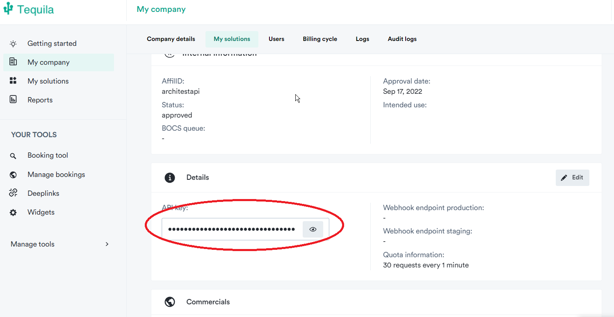

# Cheap Flight Finder

Program that searches for the cheap flights between tomorrow and six 
months later using [Tequila Api](https://tequila.kiwi.com/) and [Sheety Api](https://sheety.co/).
Additionally, [environs](https://github.com/sloria/environs) library is needed in order to read environmental variables from .env files.
## Step 1
Make a copy of the [Google sheet](https://docs.google.com/spreadsheets/d/1QcwzGSP_2ZXs82xLTNAsP3Dm31-CuSGZXP1wOfl6Jw4/edit#gid=0).
You can edit the prices, so they correspond to the prices of your origin. You can also 
add extra rows, if you wish by specifying name of the city and average price of the ticket from your city. You can leave IATA code empty, the program will take care of it.

## Step 2
Register in [Sheety Api](https://sheety.co/), use the same gmail account which you used to copy the Google sheet.

The free tier for the Sheety API only allows 200 requests per month. Please register and create a new project:
 
and add the link of your copied Google sheet:

Please enable get and put behaviors to the sheet:


## Step 3

Register in [Tequila Api](https://tequila.kiwi.com/). After that create a new solution:

When registering for your API key choose Meta Search as your product type.

Then choose One-Way and Return enter the name and click Create.

## Step 4
After registering in both API, create a file .env which will include SHEETY_ID - 
a username, in general automatically generated, which can be found here:

and TEQUILA_API - apikey from Tequila API:

Additionally, add three more environmental variables
- MY_EMAIL (containing the email address from which you will send en email)
- PASSWORD_EMAIL (password to the email, in case of gmail it would be  12 character token, for more info please read more [here](https://levelup.gitconnected.com/an-alternative-way-to-send-emails-in-python-5630a7efbe84) ) 
- TO_EMAIL
(an address to which an email will be sent, currently only one). 

The final version of the .env file should look like this

```python
SHEETY_ID="your username/number"
TEQUILA_API="your apikey"
MY_EMAIL = "email from which you send the email"
PASSWORD_EMAIL = "password to MY_EMAIL"
TO_EMAIL = "email to which you send the email."
```

## STEP 5
On the line 12 in file main.py change your origin IATA city code to the one that you will use and run the program.

The program should print either "city": $<cheapest-found-price> or "No flights found for <IATAcode>". If the price is lower than the one given
in the Google Sheet, then an email will be sent and the program will print an information about sent email.